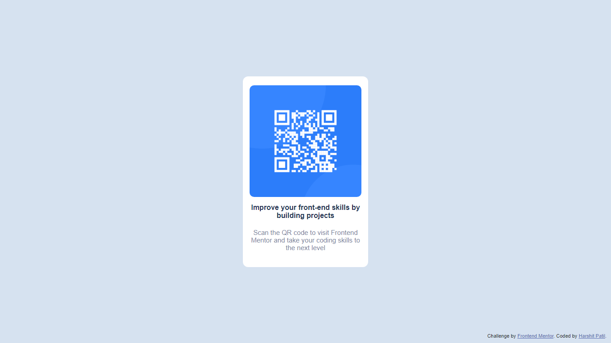

# Frontend Mentor - QR code component solution

This is a solution to the [QR code component challenge on Frontend Mentor](https://www.frontendmentor.io/challenges/qr-code-component-iux_sIO_H). Frontend Mentor challenges help you improve your coding skills by building realistic projects. 

## Table of contents

- [Overview](#overview)
  - [Screenshot](#screenshot)
  - [Links](#links)
- [My process](#my-process)
  - [Built with](#built-with)
  - [Useful resources](#useful-resources)
- [Author](#author)

## Overview

### Screenshot

### Links

- Solution URL: [Add solution URL here](https://your-solution-url.com)
- Live Site URL: [Add live site URL here](https://your-live-site-url.com)

## My process

### Built with

- Semantic HTML5 markup
- CSS custom properties
- Flexbox
- Mobile-first workflow

### Useful resources

- [Google Fonts](https://fonts.google.com) - This helped me for adding fonts.
- [Visual Studio Code](https://code.visualstudio.com) - This is an amazing software which saved a lot of my time.

## Author

- Website - [Harshit Patil](https://harshitpatilx.github.io)
- Frontend Mentor - [@harshitpatilx](https://www.frontendmentor.io/profile/harshitpatilx)
